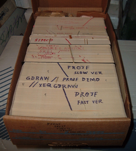
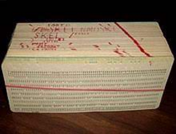
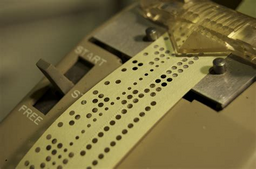
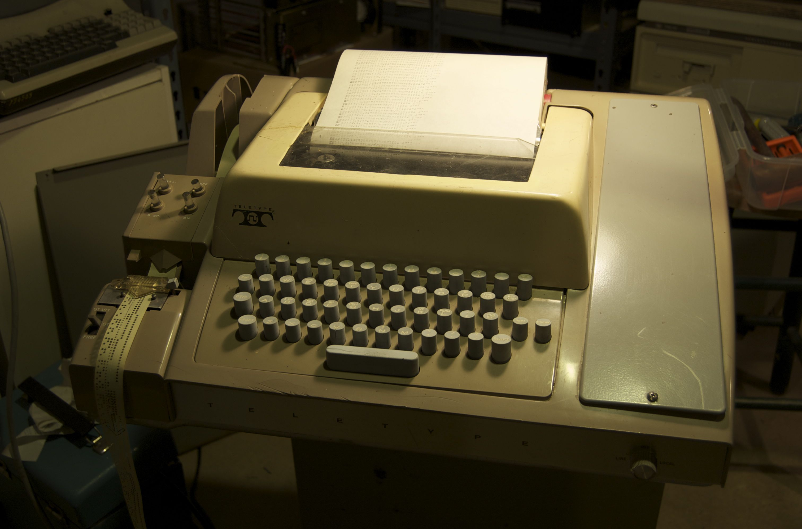
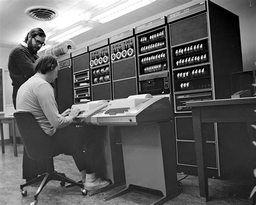

<div align="center">
  <a href="https://git-scm.com/images/logo@2x.png">
    <h1><p><b>DD</b></p></h1>  
  </a>
</div>

tl;dr

Plugin USB, use lsblk again to identify your device:

    lsblk 

Say, your device is sdb1

    unmout/dev/sdb1 # Unmount device: 

Make sure it is unmounted, use:

    lsblk # again, mountpoint should be removed

Make it bootable:

**Important:** The image must be written to the **whole-disk device and not a partition**, e.g. /dev/sdb and not /dev/sdb1. Do not use tools like unetbootin which alter the image.

    fdisk /dev/sdb/

    p # press =p= to see current partitions
    n # press =n= to crate a new partition
    d # press =d= to remove existing partitions, *this to crate a "whole disk device"* <<
    w # To write changes press =w=

Now the usb stick is bootable.

For guixSD:

An ISO-9660 installation image that can be written to a USB stick or burnt to a DVD can be downloaded from ‘<https://ftp.gnu.org/gnu/guix/guix-system-install-1.3.0.x86_64-linux.iso>’.

```shell
dd if=guix-system-install-1.3.0.x86_64-linux.iso of=/dev/sdX status=progress
sync
```

Once this is done, you should be able to reboot the system and boot from the USB stick


# iso vs img? - (optical) disk image

> There is no difference in the structure of ISO and IMG formats if the IMG file is uncompressed. It is possible for an IMG format file to be renamed with the ISO file extension and then opened in software that only recognizes the ISO file format. This is an effective way of accessing disc information in programs that do not handle the IMG format. &#x2013;source: <https://www.techwalla.com/articles/what-are-the-differences-between-iso-and-img-files>)


# Aside: NOT digital images!

An image file format is file format for a *[digital image](https://en.wikipedia.org/wiki/Digital_image)*: an image is visual representation of somthing.

But that's not todays' topic: that is *disk image*:


# What are we talking about? - *What*

*copy of data on an optical disk* An *ISO file* (often called an ISO image), is an archive file that contains *an identical copy -or image- of data found on an /optical* disc/, like a CD or DVD. *They* (cd or dvd) are often used for:

-   backing up optical discs, or for
-   distributing large file sets that are intended to burned to an optical disc.

You can think of an ISO image as a complete copy of everything stored on a physical optical disc like CD, DVD, or Blu-ray disc—including the file system itself. They are a sector-by-sector copy of the disc, and no compression is used.

*the name* The name ISO was taken from **the name of the file system used by optical media**, which is usually ISO 9660.

Since it is a file format, you can store it on any storage device, not only the *optical*. But before the 'how' first the 'why':


# The idea - *Why*

*the idea* The idea behind ISO images is that you can archive an exact digital copy of a disc, and then later use that image to burn a new disc that’s in turn an exact copy of the original. Most operating systems (and many utilities) also allow you **mount an ISO image as a virtual disc**, in which case all your apps treat it as if a real optical disc were inserted.

*backup vs distributing programs* While many people do use ISO images for creating backups of their optical disc, ISO images these days are used primarily for distributing large programs and operating systems, because it allows all the files to be contained in one easily downloadable file. People can then decide whether they want to mount that image or use it to burn an optical disc.

*OS* Most downloadable operating systems, including Windows and various Linux distros are distributed as ISO images. This comes in handy when downloading the current version of Ubuntu to install on your machine or installing that old game disc on a laptop without a physical drive.


# Clone/mount/burn/extract etc. aka - *How*

Now, because it is a *file format*, you can store it on any storage device.


## 1. Ad sd: OS /Imaging

source: [Pinebook Pro - PINE64](https://wiki.pine64.org/index.php/Pinebook_Pro) and [NOOB - PINE64](https://wiki.pine64.org/index.php/NOOB): **Setting up your device (i.c. the pinebook pro)**

Linux PC or MAC with a SD Card Reader connected to the Internet

-   i.c. the pinebook with the pre installed OS! If sd card plugged in, PBP boots from it, else it boots from eMMC;

Step-by-Step Instructions to Flashing MicroSD Cards

1.  from Windows (&#x2026;)
2.  from OS X (&#x2026;)
3.  from Linux

*Ad 3. **Imaging microSD on Linux***

*Requirements* You will need the following utilities to get started with imaging the OS of your choice onto your microSD card:

-   A compression Utility (used to unarchive the OS image). We recommend you use 7Zip.
-   A disk image utility (used to flash the .img to your SD card in GUI). We recommend you use Etcher (but there is no arm version, only linux x86/x64 (AppImage!)) or the GUI Disks utility (aka [gnome-disk-utility](https://gitlab.gnome.org/GNOME/gnome-disk-utility/)) that ships with most popular distros.

*ASIDE* do not see any AppImage for ARM?! Did find a repository where you can download an apt (debian based) package: [GitHub - futurejones/balena-etcher-arm: Balena Etcher for Raspberry Pi 4 and &#x2026;](https://github.com/futurejones/balena-etcher-arm)

*Downloading and extracting OS image(s)* You can find OS images for the respective devices in the [device section](http://wiki.pine64.org/index.php/Main_Page) on the main page. On Linux you can only use images designated as ‘DD’.

Having downloaded the required OS image proceed to use 7zip to unarchive it by double clicking the archive, and selecting ‘Extract All’. Upon completion, note the destination where the .img file was extracted (‘Downloads’ folder by default). Once the process has completed, you can proceed to imaging the .img file.

*Imaging the microSD card*

-   From GUI
-   Imaging from Terminal

*Imaging from terminal*

Insert the sdcard en ga verder bij *unmount the sdcard and why! and if needed backup!*


### Pinebook Pro - Debian from Scratch, Debian 'upstream' and Pinebook Por Debian Installer

Download at: [Pinebook Pro Debian Installer - PINE64](https://wiki.pine64.org/index.php/Pinebook_Pro_Debian_Installer)

-   script: [GitHub - daniel-thompson/pinebook-pro-debian-installer: Unofficial Debian ins&#x2026;](https://github.com/daniel-thompson/pinebook-pro-debian-installer/)

-   Unmount any existing filesystems on the disk you want to install onto.
-   

;; SCRIPT

```shell
git clone  https://github.com/daniel-thompson/pinebook-pro-debian-installer/
```

Now got into the folder

```shell
cd pinebook-pro-debian-installer
```

Now run the script:

Run ./install-debian. This will default to installing to the SD card, to change this try ./install-debian BLKDEV=/dev/mmcblk0, ./install-debian BLKDEV=/dev/mmcblk2 or ./install-debian BLKDEV=/dev/sda as appropriate.

```
./install-debian
```

Additional options


## unmount the sdcard and why! and if needed backup!


### 1. umounting and why

1.  after inserting sd card,
2.  navigate to the (backup)destination/download directory and
3.  find out device identifier -**mostly auto mounted, so unmount (via cli!!) every partiton that assoiated with sdcard :; for; sure no 'open file handles'** ; less chance corruption
4.  type lsblk
5.  Hint: the drive you currently have booted from has the / at the end of the line. This is the wrong drive. Look at the drive that matches your microSD card’s size.
6.  umount!
7.  if need backup!
8.  Now you are ready to write the image to the microSD card using this command: (replace the pine.img file with your image and mmcblkX with the correct device for the microSD card): sudo dd if=pine.img of=/dev/mmcblkX bs=1M status=progress conv=fsync
9.  use the command sync to ensure everything is written to the microSD card.
10. Wait patiently for the process to complete.
11. use the command sync to ensure everything is written to the microSD card.
12. The card is ready to boot

(sometimes this process fails and your microSD card can't boot, one way of fixing this is just to repeat the same thing, you can also try a different microSD card)

```shell
lsblk
```

to see where partitions are actually mounted

```shell
df -h
```

```shell
sudo umount /dev/mmcblk1p2
```


### 2. if needed, first *backup* the system on the sdcard (and shrink it) to the 'eMMC'!

need enoufg space (!!!!!), i.c. I do a backup! We do not de sepearate partitions, because we want a backup entire sd card, of inclduding partitiontable and all

```shell
sudo dd if=/dev/mmcblk1 of=sdcard.img bs=4M; sync
```

-   use the command sync to ensure everything is written to the microSD card.

Now, to backup **your system**, you need an exact same size or bigger, to make an exact copy of OS!!! OR use PiShrink!!! to shrink the image

Now we *zip*:

```shell
gzipp sdcard.img
```

or, together: sudo dd if=/dev/mmcblk1 | gzip > sdcard2.ing.gz

Now we reverse

```shell
sudo dd if=sccard.img of=/dev/mmcblk1 bs=4M; sync
```

Or

```shell
gzip -dc sccard.img | sudo of=/dev/mmcblk1 bs=4M; sync
```

Now, put it back in your PBP (or pi) and you are back in business! (zie ook: [How to Back Up/Image your SD Card on Linux - YouTube](https://www.youtube.com/watch?v=sUYVKhI_84E&list=PLT98CRl2KxKGAPmMdAy3folFiiiJqKtoP&index=20)

NOW, can we do something like this with docker??? TODO!!


### 3. if needed shrinking an .img

wget <https://raw.githubusercontent.com/Drewsif/PiShrink/master/pishrink.sh>


### 4a. if 1. OS/Imaging

Now "dd" the downloaded image on the sd card and its ready to boot! Zie ook overzicht hiervoor


### 4b. if 2. script upststream debian

-   after inserting and umoumt sd
-   copy url of script ( <https://github.com/daniel-thompson/pinebook-pro-debian-installer/> )

```shell
git clone https://github.com/daniel-thompson/pinebook-pro-debian-installer/
```

go in the folder

```shell
sudo ./install-debian
```

**set locale as default!!!**

finish setup (most notable, choose your desktop!!)


# Aside: other types than optical (&#x2026;) - Unix’s “Everything Is a File”

Like many Unix and Linux commands, dd reads in from standard input and writes out to the standard output.

It also relies on the Unix model that most things can be treated as files; that is, they need to be opened, can be read from, written to, and then closed.

> First, much of the sentiment you can find online and in books about Unix being all about file I/O and Windows being "broken" in this regard is obsolete. Windows NT fixed a lot of this. &#x2013;source: [A layman's explanation for "Everything is a file" — what differs from Windows&#x2026;](https://unix.stackexchange.com/questions/141016/a-laymans-explanation-for-everything-is-a-file-what-differs-from-windows)

*storage* *memory*

-   floppy
-   hd
-   usb
-   sd
-   ssd
-   emmc
-   nvme
-   etc

Other "files" &#x2026;

**Aside: file, file format**

> In 1952, "file" denoted, among other things, information stored on punched cards.
> 
>      
> 
> On most modern operating systems, files are organized into one-dimensional arrays of bytes. The format of a file is defined by its content since a file is solely a container for data.
> 
> (&#x2026;)
> 
> On some platforms the format is indicated by its filename extension, specifying the rules for how the bytes must be organized and interpreted meaningfully.
> 
> (&#x2026;)
> 
> &#x2013;source: [Computer file - Wikipedia](https://en.wikipedia.org/wiki/Computer_file)

> A file format is a standard way that information is [*encoded*](sec.md) <sup><a id="fnr.1" class="footref" href="#fn.1" role="doc-backlink">1</a></sup> for storage in a computer file. It specifies how bits are used to encode information in a digital storage medium. File formats may be either proprietary or free. &#x2013;source: [File format - Wikipedia](https://en.wikipedia.org/wiki/File_format)

./img/

**Aside: file extensions\*** Aside: compression\*


# Aside: types of memory

> An archaic synonym for memory is store. &#x2013;source:[Computer memory - Wikipedia](https://en.wikipedia.org/wiki/Computer_memory#cite_note-computerhistory-7)

Data *storage* is the recording (storing) of information (data) in a storage medium.

*Memory* (in computing) is a device or system that is used to store information for immediate use in a computer (or related computer hardware and digital electronic devices).

Computer memory operates at a high speed compared to *storage* that is slower but less expensive and higher in capacity.

Besides storing **opened programs**, computer memory serves as disk cache and write buffer to improve both reading and writing performance. Operating systems borrow RAM capacity for caching so long as not needed by running software.

If needed, contents of the computer memory can be transferred to storage; a common way of doing this is through a memory management technique called virtual memory.

Modern memory is implemented as semiconductor memory.

There are two main kinds of semiconductor memory, volatile and non-volatile. Volatile memory is computer memory that requires power to maintain the stored information.

Examples of non-volatile memory are flash memory and ROM, PROM, EPROM and EEPROM memory.

Examples of volatile memory are dynamic random-access memory (DRAM) used for primary storage, and static random-access memory (SRAM) used for CPU cache.

RAM - working memory - short term. DRAM dominates for desktop system memory. SRAM is used for CPU cache.

Most semiconductor memory is organized into memory cells each storing one bit (0 or 1).

Zie verder: [Computer hardware - Wikipedia](https://en.wikipedia.org/wiki/Computer_hardware) oa:

*Von Neumann architecture*

The template for all modern computers is the Von Neumann architecture, detailed in a 1945 paper by Hungarian mathematician John von Neumann. This describes a design architecture for an electronic digital computer with subdivisions of a processing unit consisting of an arithmetic logic unit and processor registers, a control unit containing an instruction register and program counter, a memory to store both data and instructions, external mass storage, and input and output mechanisms. The meaning of the term has evolved to mean a stored-program computer in which an instruction fetch and a data operation cannot occur at the same time because they share a common bus. This is referred to as the Von Neumann bottleneck and often limits the performance of the system.

Ga verder met:

-   Code
-   dat andere boek

## Footnotes

<sup><a id="fn.1" class="footnum" href="#fnr.1">1</a></sup> code is a system of rules (e.g. a (cryptographic) hash function?!) to convert information into another form, *sometimes shortened or secret*, for communication through a communication channel or storage in a storage medium